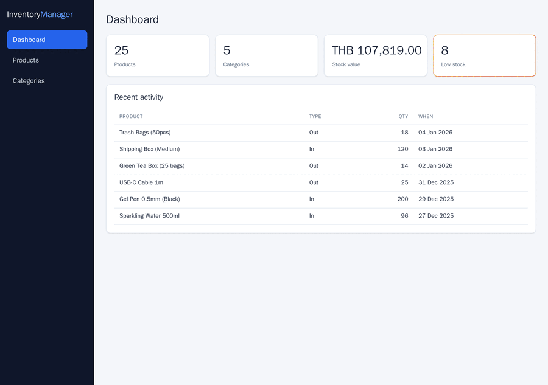
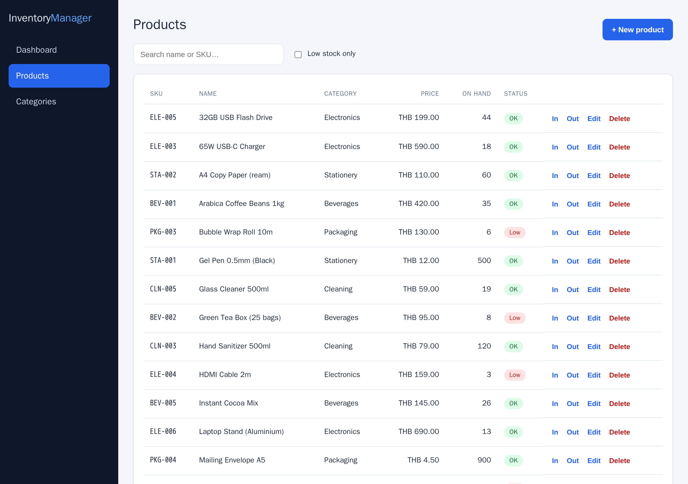
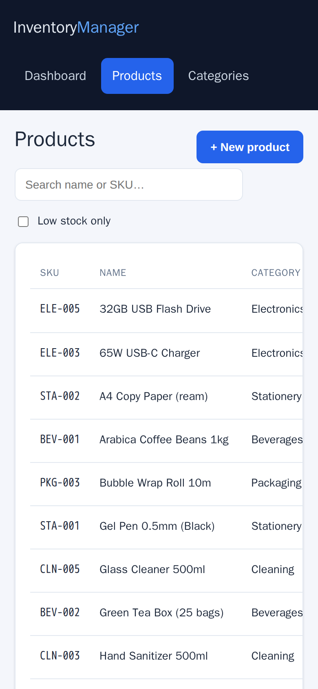

# Inventory Manager

A fullstack inventory and stock-control application — tracked products and categories,
stock-in / stock-out movements with a full ledger, low-stock alerts, and a dashboard.
Backed end-to-end by automated tests and shipped as a Docker Compose stack that runs with
a single command.


<!-- Add a screen recording of the dashboard + a stock movement here. -->


## Features

- **Products & categories** — full CRUD with SKU uniqueness and server-side validation.
- **Stock movements** — stock-in / stock-out recorded as an immutable ledger; the product
  quantity and the ledger entry are written in a single database transaction, and a
  stock-out that would drive quantity below zero is rejected.
- **Low-stock alerts** — anything at or below its reorder level is flagged in the list and
  counted on the dashboard.
- **Dashboard** — total products, total stock value, low-stock count, and recent activity.
- **Self-documenting API** — Swagger UI generated from the controllers.
- **Seeded demo data** — the app is populated on first run, so there is something to see
  immediately.

## Tech stack

| Layer | Technology |
|-------|------------|
| Backend | ASP.NET Core (.NET 10), EF Core, SQL Server |
| Frontend | React 18, TypeScript, Vite |
| Web server | nginx (serves the SPA and reverse-proxies the API) |
| Tests | xUnit (unit + integration), Playwright (end-to-end) |
| Infrastructure | Docker Compose |

## Quick start

> Prerequisites: **Docker and git only.** No .NET, Node, or SQL Server installation needed.

```bash
git clone https://github.com/peemphetpimolzzz/inventory-manager.git
cd inventory-manager
cp .env.example .env
docker compose up --build
```

Then open:

- Web app — <http://localhost:8080>
- API docs (Swagger) — <http://localhost:8081/swagger>

The database schema is migrated and seeded automatically on startup.

## Architecture

```
browser ─▶ web (nginx)  ──/api──▶  api (ASP.NET Core)  ──▶  db (SQL Server)
              static SPA              EF Core + Swagger          persisted volume
```

nginx serves the built React app and reverse-proxies `/api` to the API container, so the
browser only ever talks to one origin — no CORS configuration is required in production.

## Running the tests

```bash
# Unit tests (pure stock rules — no database)
docker run --rm -v "$PWD:/src" -w /src mcr.microsoft.com/dotnet/sdk:10.0 \
  dotnet test backend/tests/InventoryManager.UnitTests/InventoryManager.UnitTests.csproj

# Integration tests (real API against a throwaway SQL Server)
docker compose -f docker-compose.yml -f docker-compose.test.yml run --rm integration-tests

# End-to-end tests (Playwright against the full running stack)
docker compose up -d --build
docker compose -f docker-compose.yml -f docker-compose.test.yml run --rm e2e
```

All three suites also run on every push via GitHub Actions (`.github/workflows/ci.yml`).

## Project structure

```
inventory-manager/
├── backend/
│   ├── src/InventoryManager.Api/      # ASP.NET Core API (Domain, Data, Features)
│   └── tests/                         # xUnit unit + integration tests
├── frontend/                          # React + TypeScript + Vite, served by nginx
├── e2e/                               # Playwright end-to-end tests
├── docker-compose.yml                 # db + api + web
├── docker-compose.test.yml            # test database + test runners
└── .github/workflows/ci.yml           # unit, integration, frontend build, e2e
```

## Configuration

Copy `.env.example` to `.env`. The SQL Server `SA_PASSWORD` must meet the complexity policy
(≥ 8 characters with upper, lower, digit, and symbol). Host ports for the web app, API, and
database are configurable there.

## Screenshots

| Dashboard | Products | Mobile |
|-----------|----------|--------|
|  |  |  |

## License

[MIT](LICENSE)
